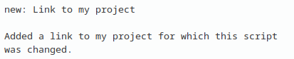

### types  

Types of commits for github.  

Commit style:  
type: Brief description (string no more than 50 characters)  
Empty line  
Description (line width no more than 72).  

#### Types:  
**feat**: _new feature_  

**fix**: _fix error_  

**del**: _delete some files_

**save**: _saving between stages_  

**new**: _add something new (scheme, prog, etc)_  

**docs**: _change in docs_  

**style**: _formating (intendation, etc)_  

**refactor**: _refactoring (renaming, etc)_  

**test**: _unittest_  

**measure**: _added measured data_  

**small**: _small changes in git files, changelogs and readmes_  

**error**:  _error founded, but not fix_  